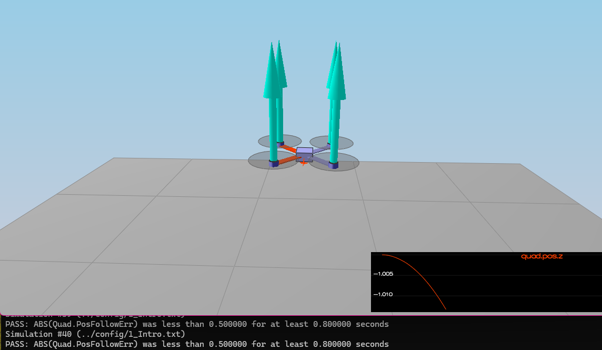
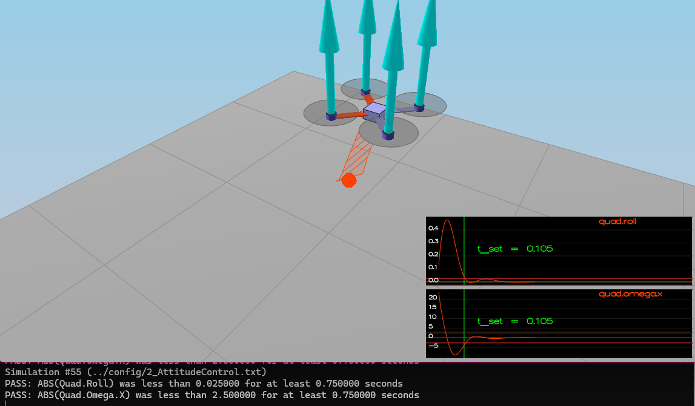
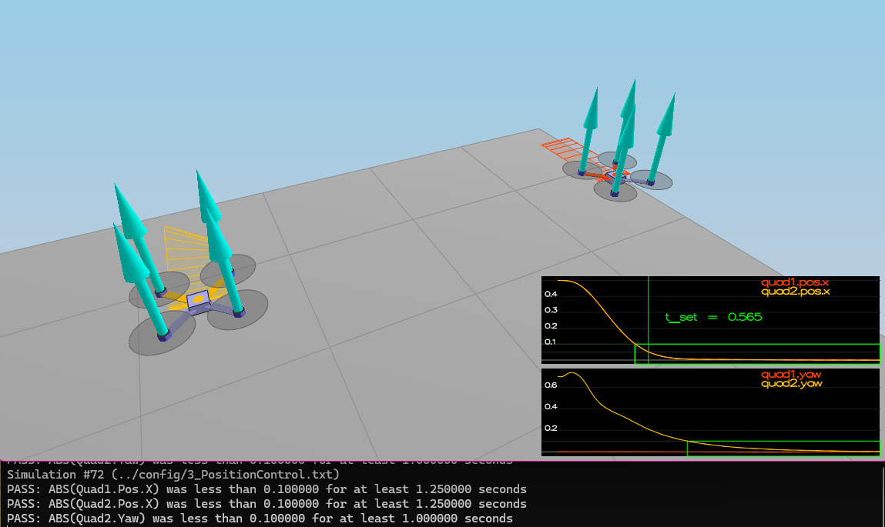
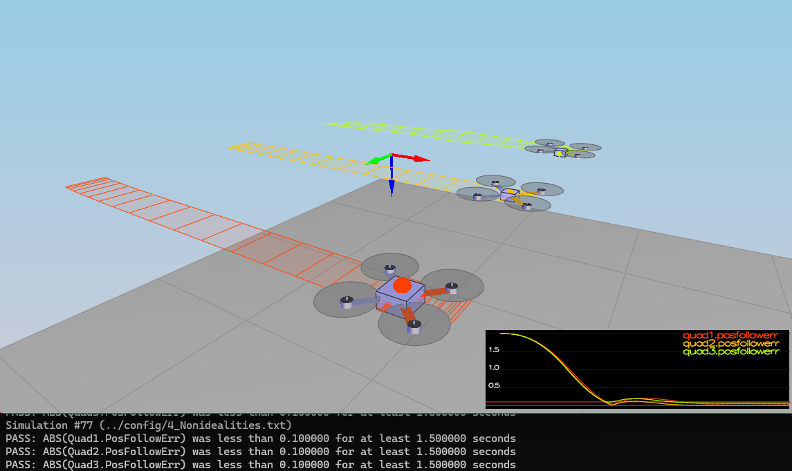
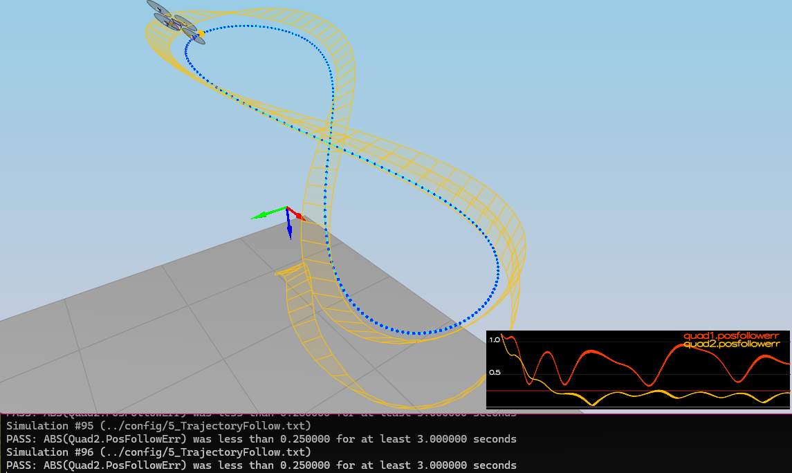

# Building a Controller Project: Writeup

_Note that any measure with the superscript $c$ (eg. $x^c$) is the commanded value._

## 1. Body Rate Control in C++

`QuadControl.cpp [lines 88-113]`

Used the formulas:

$M_x^c = I_{xx} * k_{p,p} * (p^c - p)$

$M_y^c = I_{yy} * k_{p,q} * (q^c - q)$

$M_z^c= I_{zz} * k_{p,r} * (r^c - r)$

where:
* $M_{x}^c$ is the commanded moment (output)
* $I_{xx}$ is the moment of inertia about an axis
* $k_{p,p}$ is the proportional gain for the body rate control
* $p^c$ is the commanded body rate
* $p$ is the actual body rate

## 2. Roll/Pitch Control in C++

`QuadControl.cpp [lines 116-159]`

I calculated desired thrust directions $b^c$:

$\begin{bmatrix} b_x^a \\\ b_y^a \end{bmatrix} = \begin{bmatrix} R_{1,3} \\\ R_{2,3} \end{bmatrix}$

$\begin{bmatrix} b_x^c \\\ b_y^c \end{bmatrix} = \frac{1}{T_{coll} / m} \begin{bmatrix} a_x^c \\\ a_y^c \end{bmatrix}$

Then used the error between desired and actual thrust directions to calculate pitch-rate commands $\dot{b_c}$.

$\begin{bmatrix} \dot{b_x^c} \\\ \dot{b_y^c} \end{bmatrix} = k_{p,bank} \left( \begin{bmatrix} b_x^c \\\ b_y^c \end{bmatrix} - \begin{bmatrix} b_x^a \\\ b_y^a \end{bmatrix} \right)$

Then calculated desired body rates:

$\begin{bmatrix} p^c \\\ q^c \end{bmatrix} = \frac{1}{R_{3,3}} \begin{bmatrix} R_{2,1} & -R_{1,1} \\\ R_{2,2} & -R_{1,2} \end{bmatrix} \times \begin{bmatrix} \dot{b_x^c} \\\ \dot{b_y^c} \end{bmatrix}$

$r^c = 0$

where:
* $R$ is the rotation matrix provided
* $b$ is a thrust direction
* $k_p$ is a proportional gain
* $p,q,r$ are body rates

## 3. Altitude Control in C++

`QuadControl.cpp [lines 161-199]`

First, I clipped commanded Z velocity $-$`maxAscentRate`$ \le \dot{z} \le $`maxDescentRate` (as Z-down is positive).

Then, I incremented the integral error term $e_i$:

$e_{i,t} = e_{i,t+dt} + (z^c - z)dt$

I then calculated the normalised thrust command $\bar{u_1}$, using PI control for $z$, P control for $\dot{z}$, and a feedforward $\ddot{z}$ term:

$\bar{u_1} = k_{p,z} (z^c - z) + k_{i,z} (e_i) + k_{p,\dot{z}} (\dot{z^c} - \dot{z}) + \ddot{z}$

Finally, I calculated collective thrust.

$T = -m \left( \frac{\bar{u_1} - g}{b_z} \right)$

## Lateral Position Control in C++

`QuadControl.cpp [lines 202-244]`

Firstly, I clipped the $x$ & $y$ velocity commands to the valid range $-$`maxSpeedXY`$\le \dot{x^c},\dot{y^c} \le$`maxSpeedXY`.

Then, I calculated $x$ & $y$ acceleration commands and capped them to the valid range $-$`maxAccelXY`$\le \ddot{x^c},\ddot{y^c} \le$`maxAccelXY`:

$\begin{bmatrix} \ddot{x^c} \\\ \ddot{y^c} \end{bmatrix} =  k_{p,xy} \left( \begin{bmatrix} x^c \\\ y^c \end{bmatrix} - \begin{bmatrix} x \\\ y \end{bmatrix} \right) + k_{p,\dot{x}\dot{y}} \left( \begin{bmatrix} \dot{x}^c \\\ \dot{y}^c \end{bmatrix} - \begin{bmatrix} \dot{x} \\\ \dot{y} \end{bmatrix} \right) + \begin{bmatrix} \ddot{x} \\\ \ddot{y} \end{bmatrix}$

The $\ddot{z}^c$ acceleration command was left as zero

## Yaw Control in C++

`QuadControl.cpp [lines 247-272]`

To ensure that yaw control did not deviate wildly between $-\pi$ and $+\pi$ when near $180^\circ$, I added a wraparound contingency. I took the sine and cosine of the error, then the arctan to convert the angle to its shortest wrapped range, rather than the actual angle in $[-\pi, \pi]$.

$e_{\psi} = \arctan(\sin(\psi^c - \psi), \cos(\psi^c - \psi))$

(where $e_{\psi}$ is the error in yaw)

The commanded yaw rate $\dot{\psi}$ could then be found using P control:

$\dot{\psi} = k_{p,\psi} \times e_{\psi}$

## Calculating Motor Commands in C++

`QuadControl.cpp [lines 56-86]`

Using the physical dynamics system:

$T_{coll} = F_1 + F_2 + F_3 + F_4$

$M_x = \frac{L}{\sqrt{2}} ( F_1 - F_2 + F_3 - F_4 )$

$M_y = \frac{L}{\sqrt{2}} ( F_1 + F_2 - F_3 - F_4 )$

$M_z = \kappa ( -F_1 + F_2 + F_3 - F_4 )$

where:
* $M$ is a moment
* $L$ is the distance from the centre of the quadcopter's mass to a rotor
* $T_{coll}$ is the collective thrust of the 4 rotors
* $F_i$ is the force produced by an individual rotor
* $\kappa$ is the drag/thrust ratio

By rearranging these equations, I calculated all $F_i^c$ given $M$, $T_{coll}$, $L$, and $\kappa$:

$F_1^c = \frac{T_{coll}^c}{4} + \frac{M_x}{4L\sqrt{2}} + \frac{M_y}{4L\sqrt{2}} - \frac{M_z}{4\kappa}$

$F_2^c = \frac{T_{coll}^c}{4} - \frac{M_x}{4L\sqrt{2}} + \frac{M_y}{4L\sqrt{2}} + \frac{M_z}{4\kappa}$

$F_3^c = \frac{T_{coll}^c}{4} + \frac{M_x}{4L\sqrt{2}} - \frac{M_y}{4L\sqrt{2}} + \frac{M_z}{4\kappa}$

$F_4^c = \frac{T_{coll}^c}{4} - \frac{M_x}{4L\sqrt{2}} - \frac{M_y}{4L\sqrt{2}} - \frac{M_z}{4\kappa}$

## Flight Evaluation

### Scenario 1: Intro

_&#8593; Image confirmation of the controller passing scenario 1's $z$ command._

### Scenario 2:

_&#8593; Image confirmation of the controller passing scenario 2's $\phi$ and $\omega$ commands._

### Scenario 3:

_&#8593; Image confirmation of the controller passing scenario 3's $x$, $\dot{x}$, and $\psi$ commands for all drones._

### Scenario 4:

_&#8593; Image confirmation of the controller passing scenario 4's position commands for all drones._

### Scenario 5

_&#8593; Image confirmation of the controller passing scenario 5's position command for drone 2._
